# README - Sitter App

## Identification of the problem you are trying to solve by building this particular marketplace app.

- The problem I am trying to solve is the hassle and time consuming task of finding a babysitter to look after their children. I want to build a low cost app which targets parents who live an active life and require a regular or infrequent babysitter. The babysitters will be only women and uni students who have already had the experience and looking for part-time jobs while they study.

## Why is it a problem that needs solving?

- It is a problem that needs solving as a large amount of parents find it hard to find a reliable and experienced babysitter for an affordable price. On-top of that parents sometimes face cancellation, babysitters calling in sick and more. Thus effecting their plans. We solve this issue by providing a platform where they can quickly and easily book the 'sitters' in an uber like way. 

## URL Link
- https://sitterapp.herokuapp.com/ 
## Github Link

- https://github.com/maxckelly/sitter_app

## Description
### Purpose

-  The purpose of Sitter is to connect parents with young, experienced babysitters looking for a second income on top of study or their work. The purpose is to provide convenience and ease for the two types of users.  

### Functionality 

- The functionality of the site is split into two roles. One role being the `Sitter` and the other being the `Parent`. The two users have unique views on the site and interact differently with it. The site directs the parents to create bookings and send requests to the sitters. The end result for the two users is that they agree on a price and payment is made through Stripe. The booking is then tracked by the 

### Sitemap

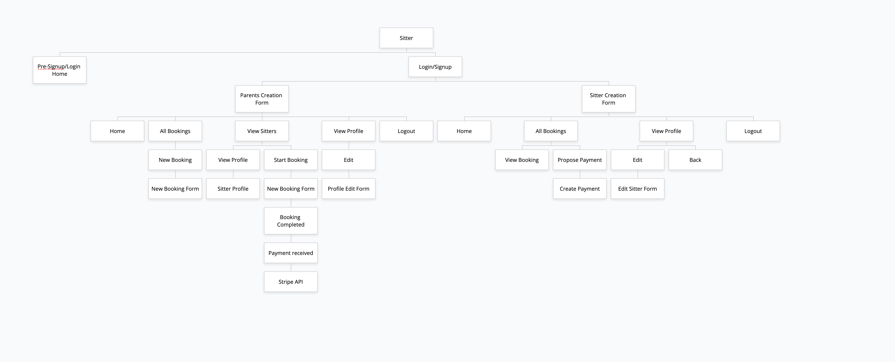

### Screenshots 
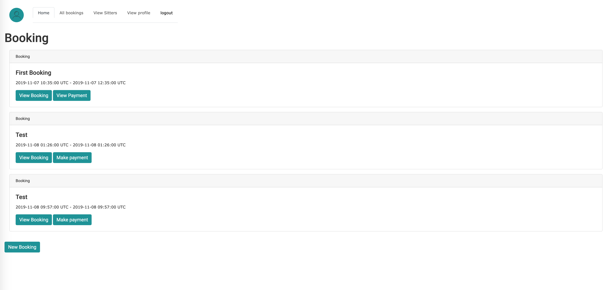
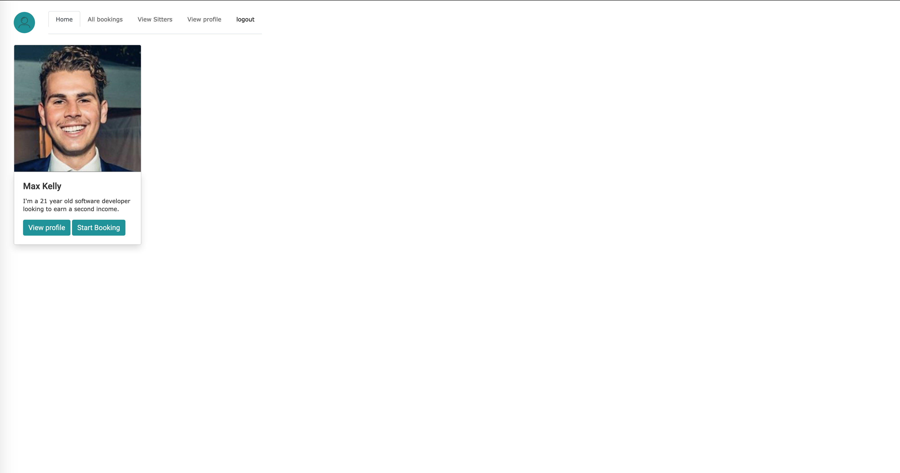
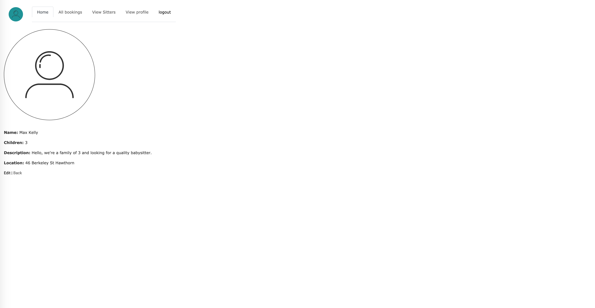
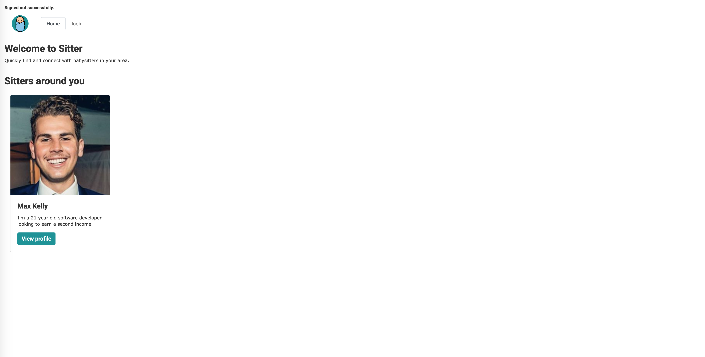

### Target Audience

- The target audience for Sitter is broken up into two parts. The first part involves lower to middle class families with young children. These families have a busy life style and unable to afford a full-time nanny or allow for one to leave their job to become a 'full-time' parent. This means they need affordable baby sitting at the convenience of their workload and lifestyle. 
- The second target audience is women between the age of 18 - 26 at university, on gap years, have a passion for looking after children etc... Our choice of having only women is that it would make the parents more comfortable as well as the fact many women have been experienced with looking after children already. The choice of targeting a younger audience is that it can be used as a source of income while they're studying and or have some other commitment.   

### Tech Stack

- My tech stack is: 
  1. HTML
  2. CSS
  3. Ruby - v2.5.1
  4. Ruby on Rails - v5.2.3
  5. Heroku deployment 
  6. Bootstrap
  7. PostgreSQL 

## User Stories 
- Our mother Alice is a mother of three children who works full-time along with her husband. Managing work and her social life Alice needs to find an affordable and trust worth platform that can provide her with quality and trained baby sitters. Alice wants to know that when she needs a baby sitter to look after her children she can quickly jump on Sitter and organise it in a short time frame. Alice wants to be able to view and see the closest and best rated baby sitters in her area, along with detailed profiles so she can do her own background check to ensure the baby sitter she is selecting is the right choice. Alice would go onto sitter and select the sitter she wishes to hire. This would then lead to the creation of a booking. Once the booking has been made then the sitter will send back a payment which the sitter needs to pay to complete.

- Our baby sitter Kara is a female full time uni student without a job but experience of looking after children. Kara wants a platform which she can go online and be hired to baby sit. She wants the ease of doing this in her own time and have it as a way to earn a little bit of money while studying. When Kara receives a booking from Alice she will be able to see the time, place and duration in which she has to work. Once Kara is happy with the booking and wishes to accept the job she will then send back a proposed payment to Alice. This will be the total fee in which she is charging for the night. Once the payment has been made by Alice then the booking is then complete.

## Wire Frames 

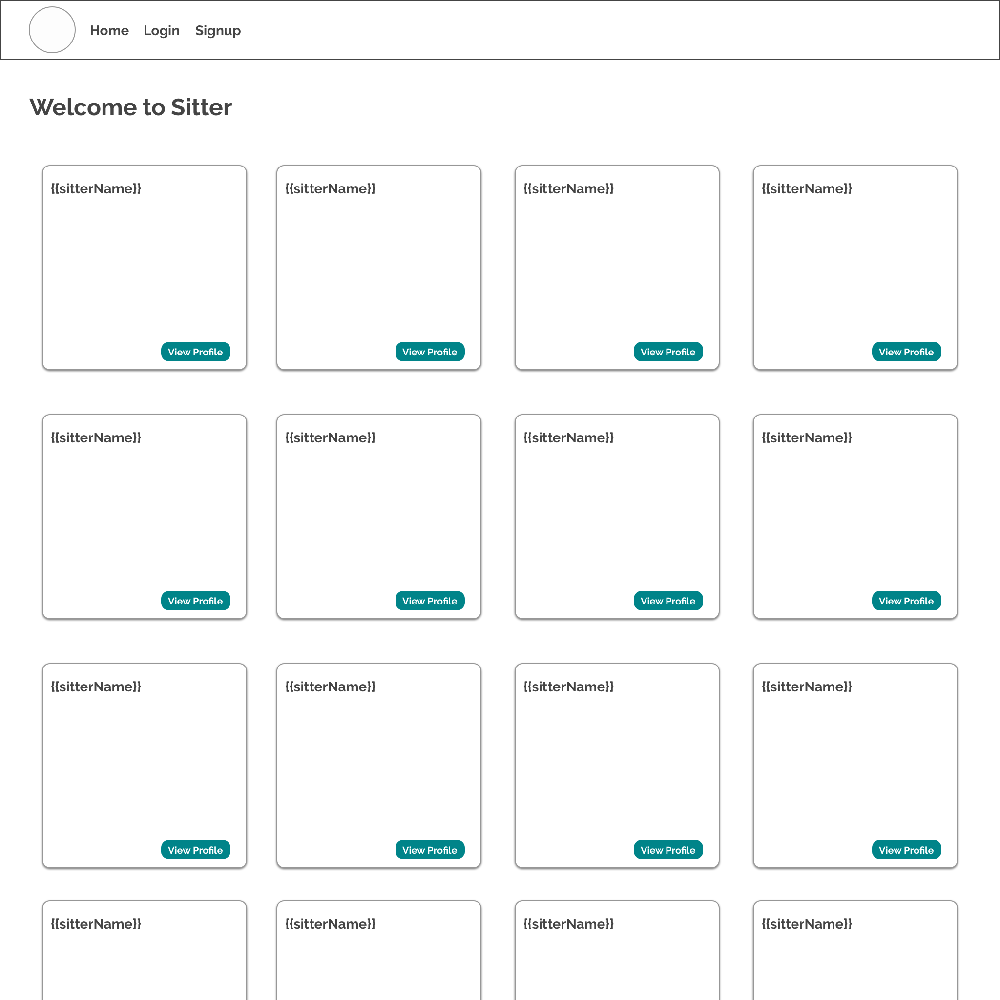
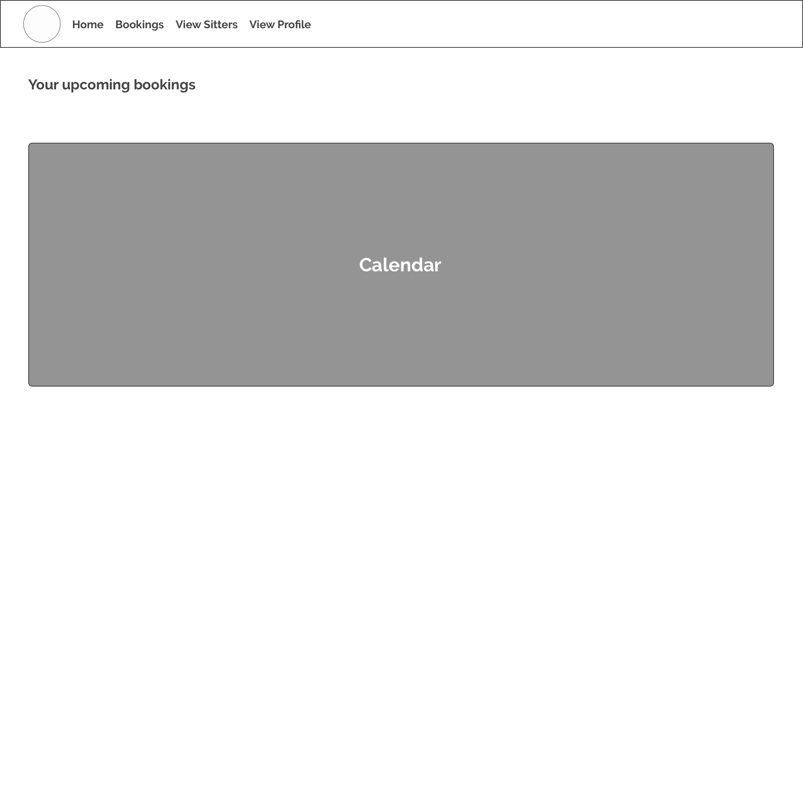
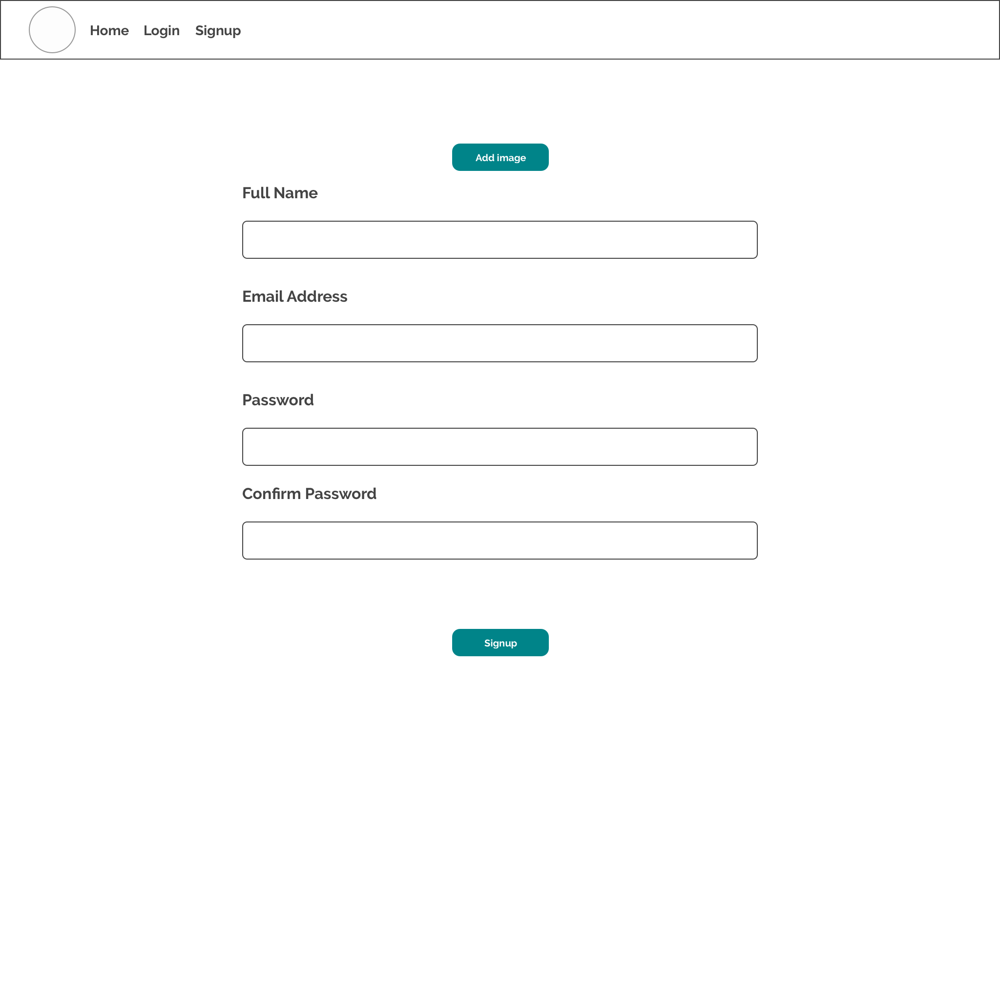
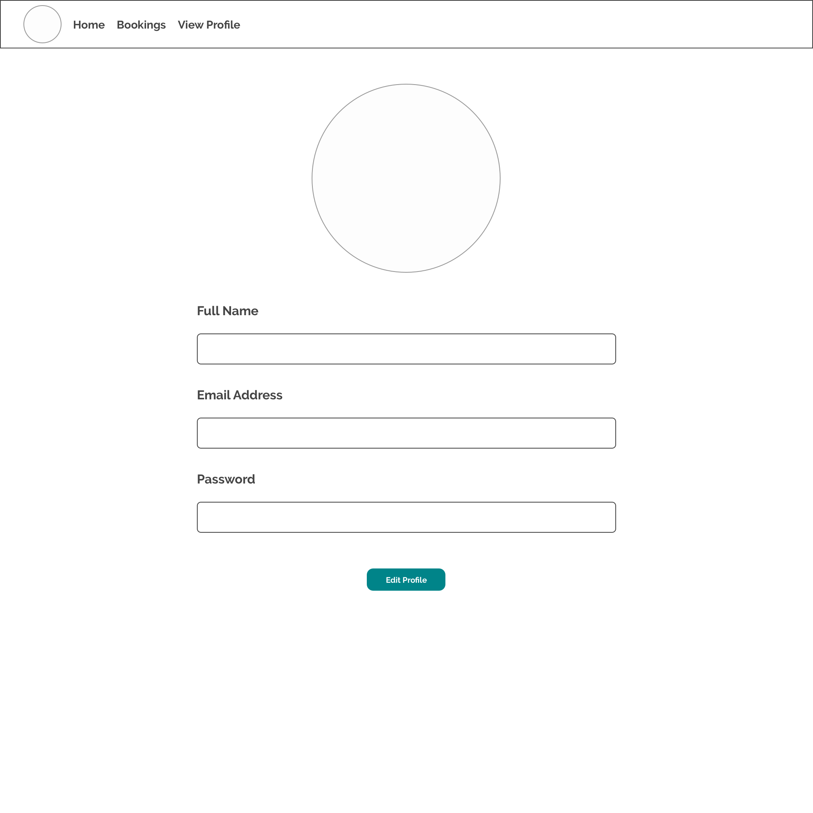
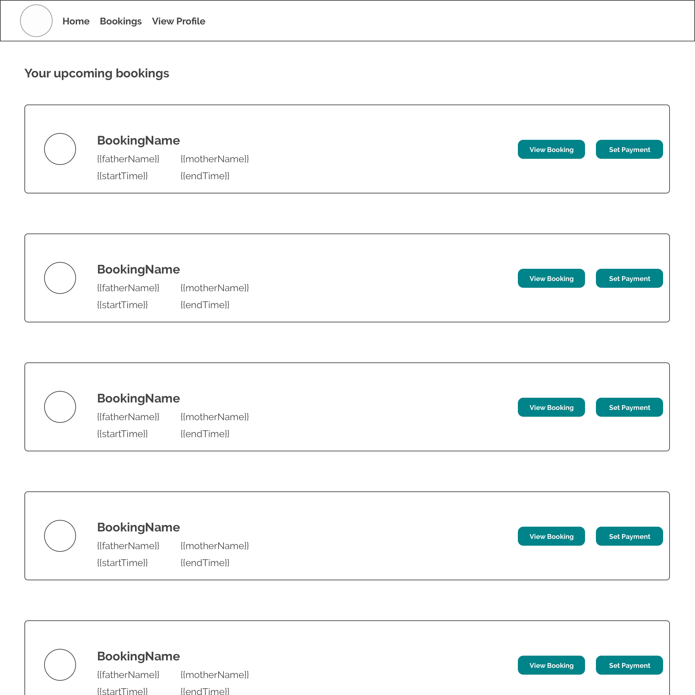
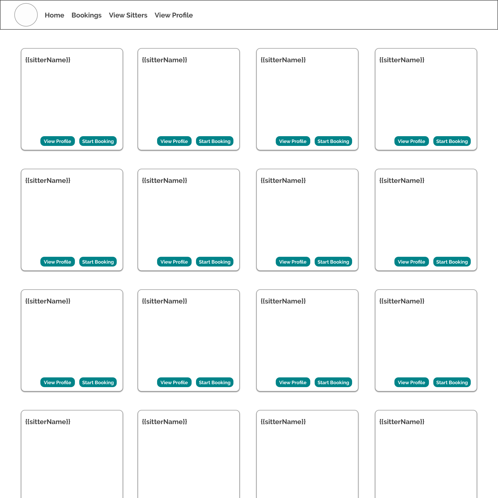

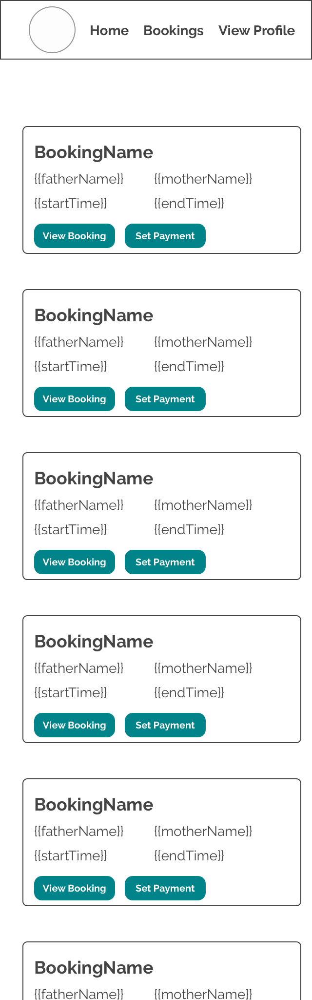
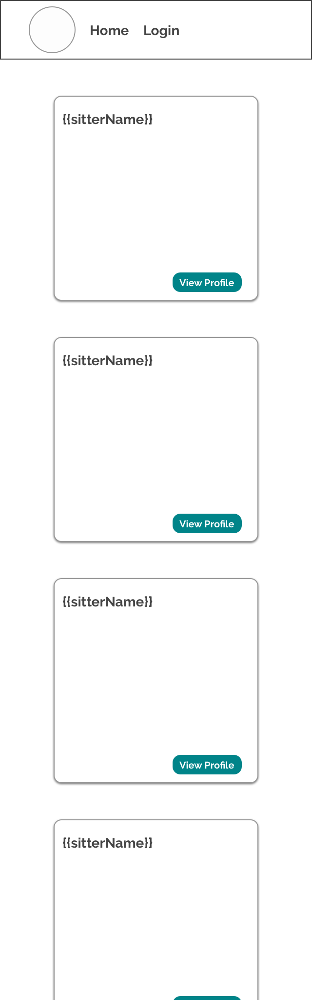
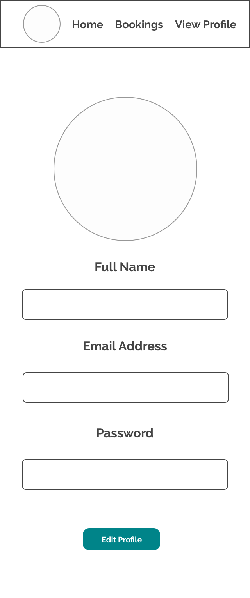

## ERD 
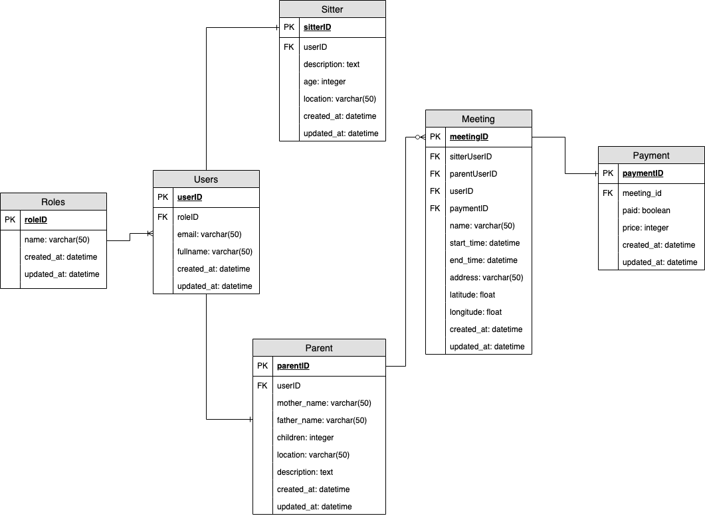
## High-level Components
- Active Record: Active record is the transpile of SQL into Ruby. It is responsible for representing business data and logic. 
- Form Helpers: The forms in applications are essential for collecting data in an efficient way. I used form helpers a lot inside my application to collect data for `meetings`, `parents`, `payments` `users` and finally `sitters`. There are a varierty of forms which you can use, I choice to use mainly the `form_with` to display my forms. I also put these into partials do help replicate them around the site without repeating myself.
- Active Storage: Active storage facilitates the uploading of files such as images, documents to be stored in the cloud. The cloud storage I went with was Amazon S3. However there are other services out there such as Google Cloud etc...
- Devise: Devise is a high level gem which is used to authenticate and sign up users to the application this can also be included with email confirmation using Mailgun or Google. In Sitter I have implemented the Google email authentication allowing the user to confirm their email before they can log into the site.
- Stripe: Stripe is the payment platform which allows the users to make secure and easy payments to each other. This can be from an 'escrow marketplace' to a simple checkout. I implemented this into the payments table allowing the sitter to propose a payment and the parent then pay. 

## Third Party Services 

- Some GEMS which I have included is:
  1. Figaro - This allows me to secure my Google credentials used to send confirm emails: https://github.com/laserlemon/figaro 
  2. Devise - Used for user SignUp and authentication: https://github.com/plataformatec/devise 
  3. Simple Calendar - Used to show users what bookings they have coming up in a calendar format
  4. GeoCoder - A way to import the longitude and latitude into Google

- Some APIs I have used:
  1. Stripe Payment System - To send and receive payments 
  2. Google Maps - Used to get the location of each meeting

## Models and Relationships
- `Meeting Model.rb`
  - The meeting model has two main relationships 1. The user table and 2. payment table. As well as this it has the geocoder gem which says grabs the address column and reverses the input in to latitude and longitude.
  - Each meeting however can only have one payment.
- `Parent Model.rb`
  - The parent model belongs to the user and has a validation of mother_name and father_name
- `Payment Model.rb`
  - The payment model simply belongs to the meeting.
- `Role_id.rb`
  - The role ID has a many relationship to users. This being that the role can have many users either being a parent or a sitter. 
- `Sitter Model.rb` 
  - The Sitter model belongs to the user and has one attached pictures. The picture is attached in the signup process.
- `User Model.rb`
  - The user model has a number of relationships. A user must belong to a role this being either a sitter or a parent.
  - The user has a one to one relationship with the parent and the sitter. Meaning that each user can only have one parent or one sitter. 
  - The user also has a one attached image which is displayed in the navbar
  - The final relationship which the user has is the one to many meetings. This allows the user to have many meetings. 
  - Finally the validation which is required is for the full name.

- My goal for the models and all relationship was to have everything point to one direction which was the user. I believe I was able to achieve this. 

## Database Relationships 
- TO DO: Migrations, foreign keys, tables. Look at your ERD and describe it in words basically
- The aim of my database was to keep it simple and 'clean' to avoid confusion and unnecessary fields. First we have the role table, this collects assigns each user with a role in the site, it has one column that is a string, each role has one user. The next table is user's which collects the basic information from the users such as email, password, name and photo this has a foreign key of the role_id. Each user can then create one sitter or parent. From there we have the parents and sitter table, this is linked to the user table when created and has datatypes such as text, integer and datetime. Each sitter and parent can have many meetings which is the next table. The meeting takes the user id from the user as well as the payment_id from the payments table. Each user can have many meetings but each meeting can have only one payment. Finally the payment table has the foreign key of meeting_id. Below is a clear example of each foreign key and how the database relationships work within the Sitter app.

  foreign key "meetings", is added to"payments"
  foreign key "meetings", is added to "users"
  foreign key "parents", is added to "users"
  foreign key "payments", is added to "meetings"
  foreign key "sitters", is added to "users"
  foreign key "users", is added to "roles"

## Database Schema Design
- Through out the sitter app I have included a number of data types. My most common one being datetime. This is due to the fact a lot of the bookings and capturing of data requires a date time. 
- `Roles`
  - The role table has a simple string for the name and a datetime for `created_at` and `updated_at`.
- `Users`
  - To start at the user table I have a two `strings` which I have included into devise. One being the email and the other is the confirmation_token which is required to confirm the email links. 
  - The second datatype that I have is the `datetime`, this is used to record a when the user is created and updated.
  - Finally I have the foreign keys such as the `role_id`, This allows me to link to the `role` table and have it so every user is has an assigned role.
- `Parents`
  - As we move into the parents table of the schema a lot of the data types begin to change as we collect a lot of the user data.
  - In the parents table we have two `strings` each being for the mother and father name. 
  - Next we have two `text` fields for fields which require a lot more information such as description and location.
  - We also have the `integer` data type which collects the amount of children the family has along with the `datetime` to store the created_at and updated_at data. 
  - The user_id is also a foreign key which is links the parent to a user. 
- `Sitters`
  - The sitter table has the following columns: name, description, age, location, created_at, updated_at. The table contains strings, text and datetime. 
- `Meetings`
  - The meetings table consists of strings, datetime, user id, payment id as well as floats. The floats are assigned to latitude and longitude which is used to assists the Google Maps API of displaying the location of the booking. The datetime is used with the start time and end times of the bookings and the strings are used to collect the name and address of the booking. 
- `Payments`
  - The payments table consists of a boolean, integer and datetimes. The boolean is used to help mark if the payment has been paid or not while the integer is used to set the price of the payment.

## Tracking of Tasks

- Tasks are tracked through the project management tool Trello. See screenshots below of my progress with tasks and tracking tasks. 
- I also used Github issue tracker to track issues which I found and fixed them at a later date. See images. 

