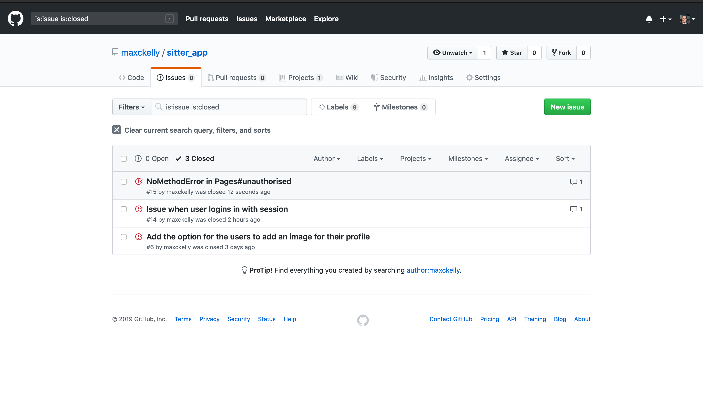

# README - Sitter App

## Identification of the problem you are trying to solve by building this particular marketplace app.

- The problem I am trying to solve is the hassle and time consuming task of finding a babysitter to look after their children. I want to build a low cost app which targets parents who live an active life and require a regular or infrequent babysitter. The babysitters will be only women and uni students who have already had the experience and looking for part-time jobs while they study.

## Why is it a problem that needs solving?

- It is a problem that needs solving as a large amount of parents find it hard to find a reliable and experienced babysitter for an affordable price. On-top of that parents sometimes face cancellation, babysitters calling in sick and more. Thus effecting their plans. We solve this issue by providing a platform where they can quickly and easily book the 'sitters' in an uber like way. 

## URL Link
- 
## Github Link

- https://github.com/maxckelly/sitter_app

## Description
### Purpose

-  The purpose of Sitter is to connect parents with young, experienced babysitters looking for a second income on top of study or their work. The purpose is to provide convenience and ease for the two types of users.  

### Functionality 

- The functionality of the site is split into two roles. One role being the `Sitter` and the other being the `Parent`. The two users have unique views on the site and interact differently with it. The site directs the parents to create bookings and send requests to the sitters. The end result for the two users is that they agree on a price and payment is made through Stripe. The booking is then tracked by the 

### Sitemap
- 

### Screenshots 
- 

### Target Audience

- The target audience for Sitter is broken up into two parts. The first part involves lower to middle class families with young children. These families have a busy life style and unable to afford a full-time nanny or allow for one to leave their job to become a 'full-time' parent. This means they need affordable baby sitting at the convenience of their workload and lifestyle. 
- The second target audience is women between the age of 18 - 26 at university, on gap years, have a passion for looking after children etc... Our choice of having only women is that it would make the parents more comfortable as well as the fact many women have been experienced with looking after children already. The choice of targeting a younger audience is that it can be used as a source of income while they're studying and or have some other commitment.   

### Tech Stack

- My tech stack is: 
  1. HTML
  2. CSS
  3. Ruby - v2.5.1
  4. Ruby on Rails - v5.2.3
  5. Heroku deployment 
  6. Bootstrap

## User Stories screenshots 

## Wire Frames 

## ERD 

## High-level Components

## Third Party Services 

- Some GEMS which I have included is:
  1. Figaro - This allows me to secure my Google credentials used to send confirm emails: https://github.com/laserlemon/figaro 
  2. Devise - Used for user Signup and authentication: https://github.com/plataformatec/devise 
  3. Simple Calendar - Used to show users what bookings they have coming up in a calendar format
  4. 

- Some API's I have used:
  1. Stripe Payment System - To send and receive payments 

## Models and Relationships

## Database Relationships 

## Database Schema Design

## Tracking of Tasks

- Tasks are tracked through the project management tool Trello. See screenshots below of my progress with tasks and tracking tasks. 
- I also used Github issue tracker to track issues which I found and fixed them at a later date. See images. 

